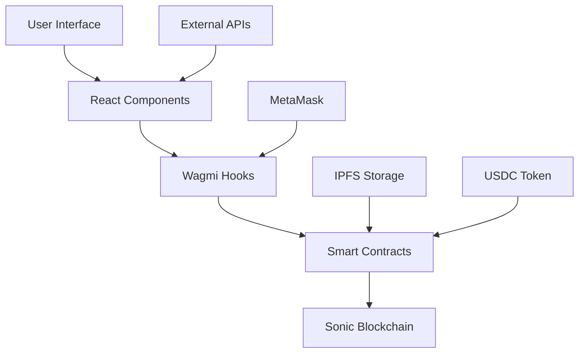
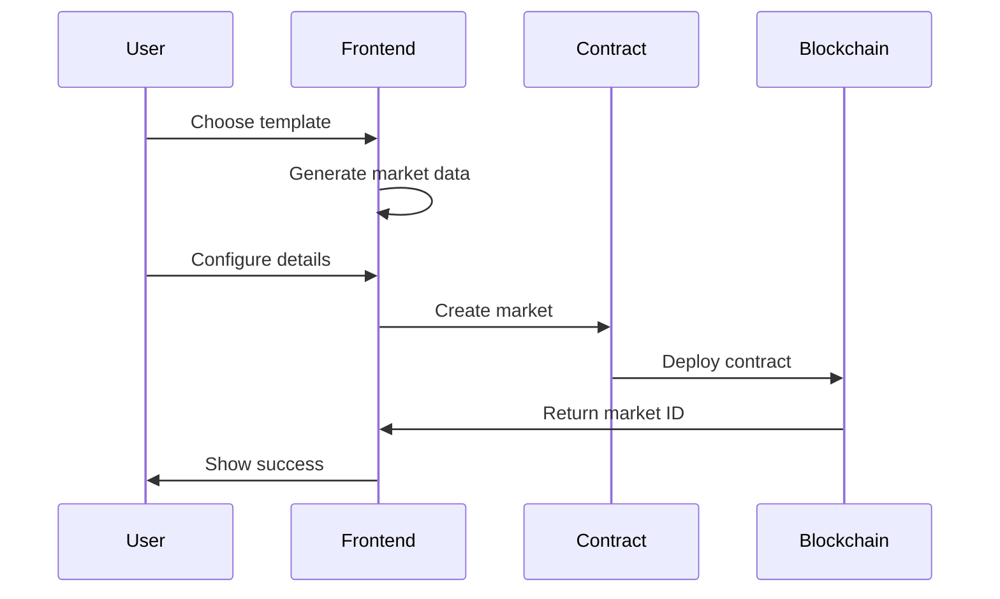
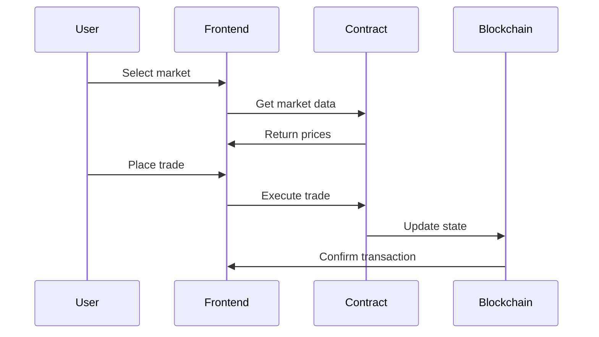
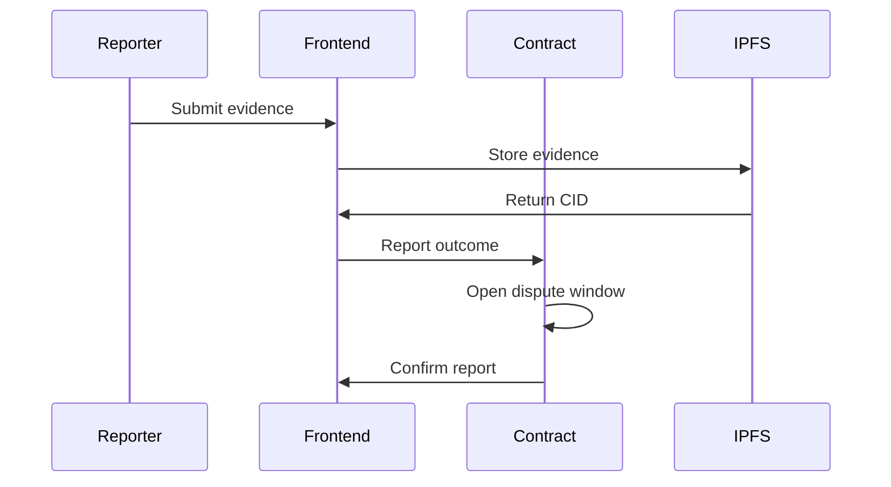

# Horizon Architecture

This document provides a comprehensive overview of Horizon's technical architecture, including system design, data flow, and component interactions.

## 🏗️ System Overview

Horizon is a decentralized prediction market platform built on Sonic blockchain, featuring a modern React frontend, smart contract backend, and integrated Web3 infrastructure.

## 🎯 Core Components

### **Frontend (Next.js)**
- **Framework**: Next.js 15 with App Router
- **Language**: TypeScript
- **Styling**: Tailwind CSS
- **State Management**: React Hooks + Context
- **Web3 Integration**: Wagmi + Viem

### **Blockchain Layer**
- **Network**: Sonic Mainnet
- **Smart Contracts**: Solidity
- **Token**: USDC (native)
- **Storage**: IPFS for evidence

### **External Services**
- **Sports Data**: ESPN API
- **Crypto Data**: CoinGecko API
- **IPFS**: Pinata for evidence storage

## 📊 Data Flow Architecture



## 🔧 Component Architecture

### **Frontend Structure**
```
apps/web/
├── app/                    # Next.js App Router
│   ├── page.tsx           # Landing page
│   ├── markets/           # Markets listing
│   ├── create/            # Market creation
│   ├── creator/           # Creator dashboard
│   └── market/[id]/       # Individual market
├── components/            # Reusable components
│   ├── ui/               # Base UI components
│   ├── create/           # Creation flow
│   └── Navigation.tsx     # Navigation bar
├── lib/                  # Utilities and hooks
│   ├── hooks/            # Custom React hooks
│   ├── config.ts         # Configuration
│   └── data/             # Demo data
└── public/               # Static assets
```

### **Smart Contract Architecture**
```
packages/contracts/
├── src/
│   ├── EventFactory.sol     # Market creation
│   ├── MarketAMM.sol         # Trading mechanics
│   ├── ResolutionManager.sol # Dispute resolution
│   └── FeeConfig.sol         # Fee management
├── test/                     # Contract tests
└── script/                   # Deployment scripts
```

## 🔄 User Journey Flow

### **1. Market Creation**


### **2. Trading Flow**


### **3. Resolution Flow**


## 🎨 UI/UX Architecture

### **Design System**
- **Theme**: Dark mode with glassmorphism
- **Colors**: Gradient-based with transparency
- **Typography**: Modern, clean fonts
- **Animations**: Subtle, purposeful motion
- **Layout**: Mobile-first, responsive

### **Component Hierarchy**
```
App
├── Navigation
├── Pages
│   ├── Landing
│   ├── Markets
│   ├── Create
│   ├── Creator
│   └── Market Detail
└── Modals
    ├── Wallet Connection
    ├── Transaction Status
    └── Error Handling
```

## 🔐 Security Architecture

### **Smart Contract Security**
- **Access Control**: Role-based permissions
- **Input Validation**: Parameter validation
- **Reentrancy Protection**: Guard modifiers
- **Integer Overflow**: SafeMath operations
- **Upgradeability**: Proxy patterns

### **Frontend Security**
- **Input Sanitization**: XSS prevention
- **CSRF Protection**: Token validation
- **Secure Storage**: No sensitive data in localStorage
- **Error Handling**: Graceful failure modes

## 📈 Performance Architecture

### **Frontend Optimization**
- **Code Splitting**: Route-based splitting
- **Lazy Loading**: Component lazy loading
- **Caching**: React Query for data
- **Bundle Size**: Tree shaking and optimization

### **Blockchain Optimization**
- **Gas Optimization**: Efficient contract calls
- **Batch Operations**: Multiple operations in one tx
- **Event Filtering**: Efficient event listening
- **State Management**: Minimal re-renders

## 🔄 State Management

### **Frontend State**
```typescript
// Global state structure
interface AppState {
  user: {
    address: string | null
    balance: bigint
    connected: boolean
  }
  markets: {
    list: Market[]
    loading: boolean
    error: string | null
  }
  ui: {
    theme: 'dark' | 'light'
    sidebar: boolean
    modals: ModalState
  }
}
```

### **Contract State**
```solidity
// Market state structure
struct Market {
    address creator;
    string title;
    string description;
    uint256 resolveAt;
    uint256 createdAt;
    bool resolved;
    uint8 outcome;
}
```

## 🌐 Network Architecture

### **Sonic Blockchain**
- **Chain ID**: 146
- **RPC**: https://rpc.soniclabs.com
- **Explorer**: https://sonicscan.org
- **Gas**: Low-cost transactions
- **Finality**: Fast confirmation

### **IPFS Integration**
- **Provider**: Pinata
- **Storage**: Evidence and metadata
- **Retrieval**: Gateway access
- **Pinning**: Persistent storage

## 🔧 Development Architecture

### **Monorepo Structure**
```
horizon/
├── apps/
│   └── web/                 # Next.js frontend
├── packages/
│   ├── contracts/           # Smart contracts
│   └── shared/              # Shared utilities
├── docs/                    # Documentation
└── tools/                   # Development tools
```

### **Build Process**
1. **TypeScript Compilation**
2. **Smart Contract Compilation**
3. **Frontend Build**
4. **Asset Optimization**
5. **Deployment**

## 📊 Monitoring & Analytics

### **Frontend Monitoring**
- **Error Tracking**: Sentry integration
- **Performance**: Web Vitals
- **User Analytics**: Privacy-focused
- **Transaction Tracking**: Web3 events

### **Blockchain Monitoring**
- **Contract Events**: Real-time tracking
- **Gas Usage**: Optimization metrics
- **Transaction Success**: Rate monitoring
- **Network Health**: RPC monitoring

## 🚀 Deployment Architecture

### **Frontend Deployment**
- **Platform**: Vercel/Netlify
- **CDN**: Global distribution
- **Environment**: Production/Staging
- **SSL**: Automatic HTTPS

### **Smart Contract Deployment**
- **Network**: Sonic Mainnet
- **Verification**: Sonicscan
- **Upgrades**: Proxy patterns
- **Monitoring**: Event tracking

## 🔄 Data Flow Examples

### **Market Creation Flow**
1. User selects template
2. Frontend generates market data
3. User configures parameters
4. Frontend calls `createMarket`
5. Contract deploys new market
6. Frontend updates UI
7. User sees new market

### **Trading Flow**
1. User selects market
2. Frontend fetches market data
3. User enters trade amount
4. Frontend calculates costs
5. User approves USDC
6. Frontend executes trade
7. Contract updates state
8. Frontend shows confirmation

### **Resolution Flow**
1. Market reaches resolution time
2. Reporter submits evidence
3. Evidence stored on IPFS
4. Contract opens dispute window
5. Community can dispute
6. Final outcome determined
7. Users can redeem shares

## 🎯 Future Architecture

### **Planned Improvements**
- **Layer 2 Integration**: Optimism/Arbitrum
- **Cross-Chain**: Multi-chain support
- **Mobile App**: React Native
- **Advanced Analytics**: Trading insights
- **Social Features**: Community integration

### **Scalability Considerations**
- **Database**: Off-chain data storage
- **Caching**: Redis for performance
- **CDN**: Global content delivery
- **Load Balancing**: Multiple RPC endpoints

---

This architecture document provides a comprehensive overview of Horizon's technical foundation. For specific implementation details, refer to the individual component documentation and code comments.
